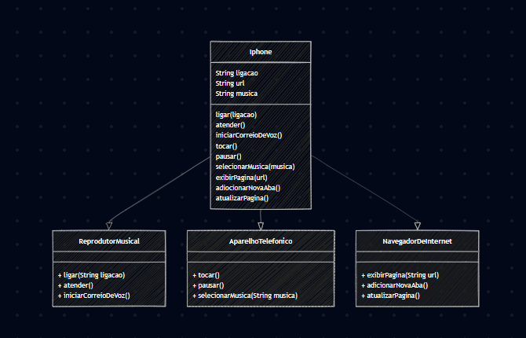

# SISTEMA IPHONE ( DIO )

## 🎇 MERMAID

Para a criação do UML foi usado o [MERMAID](https://docs.oracle.com/en/java/), foi criado um sistema de celular com as seguintes funcionalidades:

## 🛠 FUNCIONALIDADES

    REPRODUTOR MUSICA
      - ligar( String ligação )
      - atender()
      - iniciarCorreioDeVoz()

      
    APARELHO TELEFONICO
      - tocar()
      - pausar()
      - selecionarMusica(String musica)

      
    NAVEGADOR DE INTERNET
      - exibirPagina( String ligação )
      - adicionarNovaAba()
      - atualizarPagina()

---

## 🖼 FOTO DO MERMAID

---

## 🤔 O QUE FOI USANDO ?

